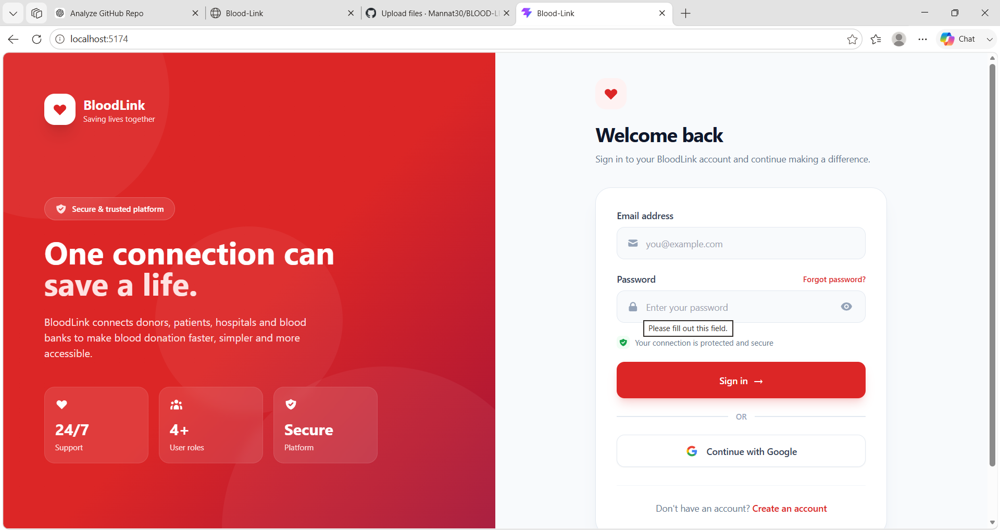
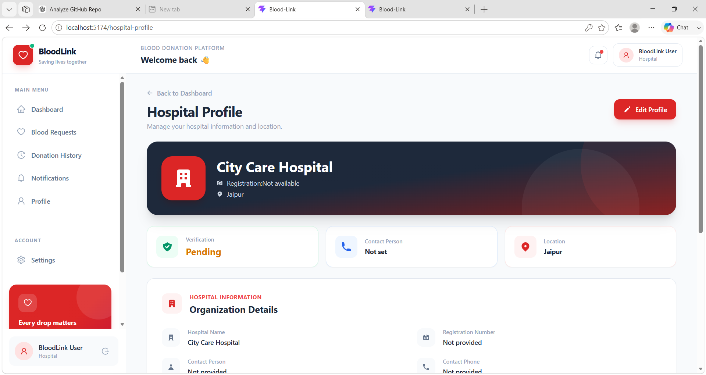

# BloodLink

> A full-stack blood donation platform that connects patients, donors, hospitals and blood banks through secure authentication, intelligent donor matching and real-time emergency notifications.

## 🚀 Overview

BloodLink is a full-stack blood donation management platform designed to make emergency blood requests faster and more organized.

The platform provides role-based workflows for donors, patients, hospitals and blood banks while using a weighted donor-matching system to rank suitable donors based on compatibility, distance, availability, donation history and reliability.

For emergency requests, the system also supports real-time notifications using WebSocket/STOMP.

---

## ✨ Key Features

### 🔐 Authentication & Security

- JWT-based authentication
- Secure password hashing using BCrypt
- Role-based access control
- Google OAuth2 login
- Stateless Spring Security configuration
- CORS configuration
- Protected REST APIs
- JWT validation and expiration handling

### 🩸 Donor Matching

BloodLink ranks potential donors using a weighted scoring algorithm.

The matching system considers:

- Blood group compatibility
- Distance from the patient
- Donor availability
- Successful donation history
- Donor acceptance/reliability
- BloodLink score
- Request priority

The system supports different distance thresholds depending on request priority.

```text
CRITICAL → 10 km
HIGH     → 25 km
NORMAL   → 50 km
```

### 🚨 Emergency Blood Requests

Patients can create blood requests with different priorities.

The system can:

1. Receive the blood request
2. Identify compatible donors
3. Calculate donor scores
4. Rank suitable donors
5. Notify relevant donors
6. Support real-time emergency communication

### ⚡ Real-Time Notifications

WebSocket/STOMP is used for real-time communication.

This allows emergency notifications to be delivered without requiring the donor to continuously refresh the page.

### 👤 Role-Based Dashboards

Different workflows are provided for:

- Donors
- Patients
- Hospitals
- Blood Banks

Each role receives access to the functionality relevant to its responsibilities.

### 📊 Donor Profile & History

Donor-related information includes:

- Profile information
- Blood group
- Availability
- Donation history
- Reliability information
- Matching score

---

# 🧠 Donor Matching Algorithm

The core matching logic uses a weighted scoring approach.

## Score Components

For a normal-priority request, the scoring model uses:

| Factor | Weight |
|---|---:|
| Blood Compatibility | 40 |
| Distance | 25 |
| Availability | 15 |
| Donation History | 10 |
| Reliability | 10 |

An additional BloodLink score contribution is normalized and incorporated into the final score.

### Distance Scoring

Distance is converted into a score using the request priority.

```text
Distance Score = 25 × (1 - distance / maximum allowed distance)
```

The maximum distance depends on request priority:

```text
CRITICAL → 10 km
HIGH     → 25 km
NORMAL   → 50 km
```

A donor outside the applicable maximum distance receives a distance score of `0`.

### Donation History

Successful donations contribute to the donor score:

```text
Donation History Score =
min(successfulDonations × 2, 10)
```

This prevents donation history from dominating the complete matching score.

### Reliability

Reliability is calculated from accepted and rejected requests:

```text
Acceptance Rate =
accepted / (accepted + rejected)
```

Then:

```text
Reliability Score =
Acceptance Rate × 10
```

For a donor without previous activity, a default reliability score is used.

### Final Score

The final score combines the individual components and is capped at 100.

```text
Final Score =
    Compatibility
  + Distance
  + Availability
  + Donation History
  + Reliability
  + BloodLink Score Contribution
```

The result is then used to rank compatible donors.

---

# 🏗️ Architecture

BloodLink follows a layered Spring Boot architecture.

```text
                    ┌─────────────────────┐
                    │   React Frontend    │
                    │                     │
                    │  Donor / Patient    │
                    │  Hospital / Bank    │
                    └──────────┬──────────┘
                               │
                         REST / WebSocket
                               │
                               ▼
                    ┌─────────────────────┐
                    │   Spring Boot API   │
                    └──────────┬──────────┘
                               │
              ┌────────────────┼────────────────┐
              │                │                │
              ▼                ▼                ▼
        Controllers       Security          Services
              │                │                │
              │          JWT / OAuth2           │
              │                │                │
              └────────────────┼────────────────┘
                               │
                               ▼
                    ┌─────────────────────┐
                    │   Spring Data JPA  │
                    │      / Hibernate    │
                    └──────────┬──────────┘
                               │
                               ▼
                    ┌─────────────────────┐
                    │     PostgreSQL      │
                    └─────────────────────┘

                         WebSocket/STOMP
                               │
                               ▼
                    Real-Time Notifications
```

---

# 🛠️ Technology Stack

## Frontend

- React
- React Router
- Axios
- Tailwind CSS
- Vite
- Lucide React
- React Icons
- React Toastify
- STOMP.js

## Backend

- Java 17
- Spring Boot
- Spring Web
- Spring Data JPA
- Hibernate
- Spring Security
- JWT
- OAuth2
- WebSocket
- STOMP
- Bean Validation
- Lombok

## Database

- PostgreSQL

## Testing

- JUnit 5
- Mockito
- Spring Boot Test
- MockMvc
- Spring Security Test
- JaCoCo

## Deployment / Development

- Docker
- Docker Compose
- Maven
- GitHub
- Vercel

---

# 🧪 Testing & Code Quality

The backend includes automated unit and integration tests using JUnit 5, Mockito, Spring Boot Test and MockMvc.

JaCoCo is used to measure test coverage.

## Current Coverage

| Layer | Instruction Coverage | Branch Coverage |
|---|---:|---:|
| Service | 95% | 79% |
| Security | 81% | 62% |
| Controller | 86% | N/A |
| Utility | 95% | 100% |
| Config | 100% | N/A |
| Exception | 100% | N/A |
| DTO | 100% | N/A |
| Enum | 100% | N/A |
| **Overall** | **93%** | **76%** |

The coverage report was generated using JaCoCo across 63 backend classes.

### Run Tests

From the backend directory:

```bash
./mvnw clean test
```

On Windows:

```powershell
.\mvnw.cmd clean test
```

### JaCoCo Report

After running the tests:

```text
target/site/jacoco/index.html
```

Open this file in a browser to view the detailed coverage report.

---

# 🔒 Security

BloodLink uses Spring Security with JWT authentication.

### Authentication Flow

```text
User
 │
 │ Login credentials
 ▼
AuthController
 │
 ▼
AuthService
 │
 ▼
AuthenticationManager
 │
 ▼
UserDetailsService
 │
 ▼
PasswordEncoder
 │
 ▼
JWT Service
 │
 ▼
JWT Token
 │
 ▼
Client
```

For protected requests:

```text
Client
  │
  │ Authorization: Bearer <JWT>
  ▼
JWT Authentication Filter
  │
  ▼
Token Validation
  │
  ▼
SecurityContext
  │
  ▼
Protected Controller
```

Sensitive configuration such as database credentials, JWT secrets and OAuth credentials is supplied through environment variables rather than committed directly to the repository.

---

# ⚡ Real-Time Communication

BloodLink uses WebSocket/STOMP for real-time communication.

The purpose is to support emergency notifications where a donor may need to be informed immediately after a matching blood request is created.

Conceptually:

```text
Patient creates emergency request
              │
              ▼
       Backend processes
              │
              ▼
       Find compatible donors
              │
              ▼
       Calculate donor scores
              │
              ▼
       Select relevant donors
              │
              ▼
        WebSocket/STOMP
              │
              ▼
      Donor receives alert
```

This avoids relying only on periodic frontend polling for emergency notifications.

---

# 🗄️ Database

PostgreSQL is used as the primary relational database.

The backend uses:

```text
Spring Data JPA
       ↓
Hibernate
       ↓
PostgreSQL
```

JPA entities represent the main application domain and repositories provide database access.

---
## Screenshots

### Login


### Donor Dashboard


### Patient Dashboard


### Hospital
 the main user workflows and application interface.

---

# 🧩 Important Technical Challenge

One of the main challenges was designing a donor-ranking mechanism that considers multiple factors instead of selecting donors only by blood group.

A simple blood-group filter can produce many compatible donors without considering practical factors such as distance, availability or previous donation behavior.

BloodLink addresses this by separating compatibility from ranking.

```text
Compatible Donors
       │
       ▼
Distance
       │
       ▼
Availability
       │
       ▼
Donation History
       │
       ▼
Reliability
       │
       ▼
Weighted Score
       │
       ▼
Ranked Donors
```

This makes the matching process deterministic, explainable and easier to test.

---

# 📈 Engineering Decisions

## Why Spring Boot?

Spring Boot provides:

- Strong ecosystem for REST APIs
- Spring Security integration
- JPA/Hibernate support
- Validation
- WebSocket support
- Production-oriented configuration

## Why PostgreSQL?

PostgreSQL provides a reliable relational database suitable for structured entities such as users, blood requests, donations and relationships between application objects.

## Why JWT?

JWT allows the frontend and backend to communicate using stateless authentication.

This fits the REST API architecture and avoids maintaining server-side authentication sessions for normal API requests.

## Why Rule-Based Matching?

The matching system currently uses a deterministic weighted scoring model rather than a trained machine-learning model.

This makes the score:

- Explainable
- Deterministic
- Easy to test
- Easy to debug
- Appropriate for the current available data

The scoring engine can be evolved later if sufficient real-world historical data becomes available.

---

# 🐳 Running with Docker

Make sure Docker Desktop is running.

From the project root:

```powershell
docker compose up --build
```

To stop the containers:

```powershell
docker compose down
```

Typical services include:

```text
Frontend
Backend
PostgreSQL
```

The backend communicates with PostgreSQL through the Docker Compose network.

---

# ⚙️ Environment Variables

Create your environment configuration using the provided example file.

Example:

```text
DB_HOST=
DB_PORT=
DB_NAME=
DB_USERNAME=
DB_PASSWORD=

JWT_SECRET=

GOOGLE_CLIENT_ID=
GOOGLE_CLIENT_SECRET=
```

Do not commit real secrets to GitHub.

The repository should contain only example configuration such as:

```text
.env.example
```

---

# 📁 Project Structure

```text
BloodLink
│
├── bloodlink-backend
│   │
│   ├── src
│   │   ├── main
│   │   │   ├── java
│   │   │   │   └── com.bloodlink
│   │   │   │       ├── config
│   │   │   │       ├── controller
│   │   │   │       ├── dto
│   │   │   │       ├── entity
│   │   │   │       ├── exception
│   │   │   │       ├── repo
│   │   │   │       ├── security
│   │   │   │       ├── service
│   │   │   │       └── util
│   │   │   │
│   │   │   └── resources
│   │   │       └── application.yml
│   │   │
│   │   └── test
│   │
│   └── pom.xml
│
├── src
│   ├── components
│   ├── services
│   ├── types
│   ├── App.jsx
│   ├── main.jsx
│   └── index.css
│
├── docs
│   └── screenshots
│
├── .env.example
├── docker-compose.yml
├── package.json
├── vite.config.js
└── README.md
```

---

# 🔄 Application Flow

```text
                  ┌───────────────┐
                  │     User      │
                  └───────┬───────┘
                          │
                          ▼
                  ┌───────────────┐
                  │ React Client  │
                  └───────┬───────┘
                          │
                    REST / JWT
                          │
                          ▼
                  ┌───────────────┐
                  │ Spring Boot   │
                  │    Backend    │
                  └───────┬───────┘
                          │
             ┌────────────┼────────────┐
             ▼            ▼            ▼
          Security     Services      WebSocket
             │            │            │
             │            ▼            │
             │       Matching Engine   │
             │            │            │
             └────────────┼────────────┘
                          │
                          ▼
                     PostgreSQL
```

---

# 🎯 Future Improvements

Potential future improvements include:

- More advanced donor recommendation models
- Historical matching analytics
- Improved notification preferences
- Hospital verification workflows
- Location-based optimization
- More extensive integration testing
- Performance benchmarking for large donor datasets
- Monitoring and observability

---

# 👨‍💻 Author

Developed as a full-stack engineering project focused on:

- Backend development
- Secure authentication
- Database design
- Real-time communication
- Algorithmic donor matching
- Automated testing
- Deployment and containerization

---

# 📄 License

This project is developed for educational and portfolio purposes.
